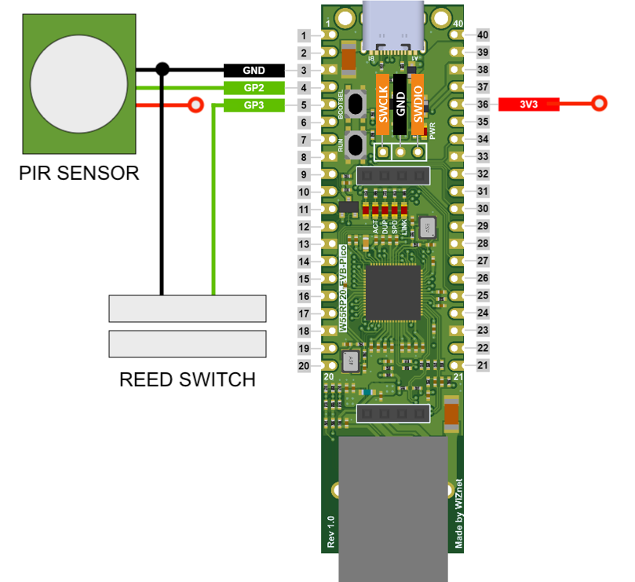
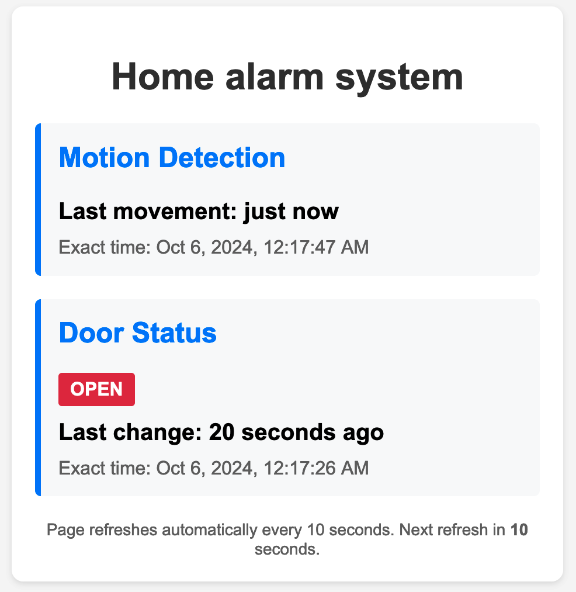
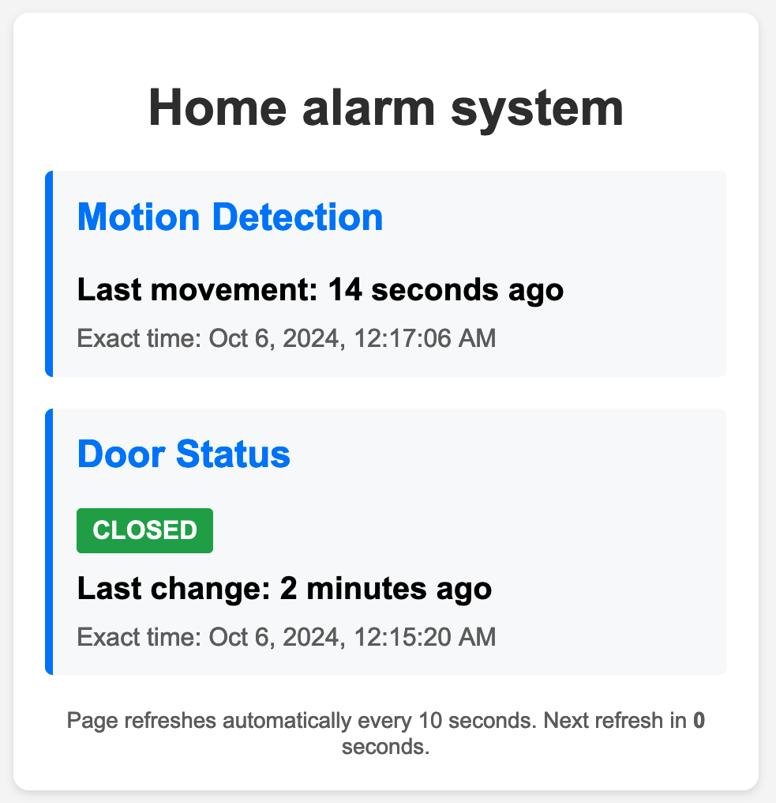

# Smart security system

<p align="center"></p>

I made this project as an entry to the [WIZnet ioNIC Contest](https://maker.wiznet.io/contest/ionic) using the [W55RP20-EVB-PICO](https://docs.wiznet.io/Product/ioNIC/W55RP20/w55rp20-evb-pico). 

Most IoT devices use wireless communication nowadays, so it is refreshing to see a microcontroller with a built-in wired Ethernet controller. 

In this project I show how to use the W55RP20-EVB-PICO to create a silent door security system with intrusion detection and ethernet communication. When it comes to security, wired communication is less prone to outside tampering, like deauthentication attacks.

## Hardware

For intrusion detection, a reed switch can be mounted to monitor when a door or window is opened. For motion detection, I used a PIR sensor. The brain of the system is the W55RP20-EVB-PICO. The components need to be connected in the following way:

<p align="center"></p>

I used a perfboard to solder the components together, but soldering wires directly to the W55RP20-EVB-PICO's pins will also work.

## Software

The W55RP20-EVB-PICO has an RP2040 inside, so for setting up the development environment, the RP2040's C SDK needs to be set up first. There are detailed steps for that on the Raspberry Pi website: [https://www.raspberrypi.com/documentation/microcontrollers/c_sdk.html](https://www.raspberrypi.com/documentation/microcontrollers/c_sdk.html). If compiling the hello world project works, the next step is to download the WIZnet PICO SDK from here: [https://github.com/WIZnet-ioNIC/WIZnet-PICO-C](https://github.com/WIZnet-ioNIC/WIZnet-PICO-C). I recommend using git to clone the project as the repo contains [submodules](https://git-scm.com/book/en/v2/Git-Tools-Submodules) which otherwise would have to be downloaded separately. 
``` sh
git clone https://github.com/WIZnet-ioNIC/WIZnet-PICO-C
```
After cloning the repo, running the following command inside the folder will download all submodule dependencies:
``` sh
git submodule update --init --recursive
```
One such submodule is the [ioLibrary_Driver](https://github.com/Wiznet/ioLibrary_Driver/tree/ce4a7b6d07541bf0ba9f91e369276b38faa619bd) for which the latest version needs to be downloaded if the code fails to compile. 

I placed the downloaded WIZnet libraries in a folder named `c-sdk` and I created a new project folder (`alarm`) with the `main.c`, `MakeLists.txt`, `webpage.h` files and the `build` folder in a directory on the same level as `c-sdk`:
```
.
├── c-sdk
│   └── [ The downloaded WIZnet PICO Libraries ]
└── alarm (project folder)
    └── main.c
    └── MakeLists.txt
    └── webpage.h
    └── build
```

For getting started, I explored the `dhcp_dns` and `http` examples. I have created the `MakeLists.txt` file to include all necessary libraries and to output the program image to the `build` folder. All files of this project can be found in the following repository: [https://github.com/ndaneil/ethernet-alarm](https://github.com/ndaneil/ethernet-alarm).

Since the microcontroller does not have a built-in RTC to keep track of time, the milliseconds elapsed will be used to measure the last time a movement was detected and to keep track of the door state (`OPEN` or `CLOSED`) change's last time. Then, we can use JavaScript and the browser's local time to interpret and display the results. Let's look at the webpage first. Here, we can use a single file with HTML+CSS+JS included. The main logic relies on the following map in the website code which is updated on the server-side when serving the webpage:
``` js
        const serverData = {
            lastMotionMs: 2000,
            doorState: "OPEN",
            lastDoorChangeMs: 10000,
            currentServerTime: Date.now()
        };
```
The webpage is refreshed every 10 seconds so that the values are updated. To store the webpage, I first minified the code so that it requires less memory. The minified webpage code is stored in the `webpage.h` file along with a couple of variables:
``` c
char WEBPAGE_HTML[] = R"( ... <script>const serverData={lastMotionMs:            ,doorState:  "OPEN", lastDoorChangeMs:            ,currentServerTime:Date.now()};
...
)";
#define LAST_MOTION_MS_START 1650
#define LAST_MOTION_MS_LENGTH 12
#define DOOR_STATE_START 1673
#define DOOR_STATE_LENGTH 8
#define LAST_DOOR_CHANGE_MS_START 1700
#define LAST_DOOR_CHANGE_MS_LENGTH 12
```
In the minified code, I added spaces for the variables so that these can be replaced inside the character array without copying it to a new location inside the memory. The defined variables above store the starting index and the length of the placeholders where the values of the elapsed times and the door state will be populated. 

In the `main.c` file, the important configuration options are the following:
Setting the network properties:
``` c
static wiz_NetInfo g_net_info =
    {
        .mac = {0x00, 0x08, 0xDC, 0x12, 0x34, 0x56}, // MAC address
        .ip = {192, 168, 11, 2},                     // IP address
        .sn = {255, 255, 255, 0},                    // Subnet Mask
        .gw = {192, 168, 11, 1},                     // Gateway
        .dns = {8, 8, 8, 8},                         // DNS server
        .dhcp = NETINFO_DHCP                         // DHCP enable/disable
};
```
I set it to DHCP, so most of the other values are overridden when the DHCP server provides the details to the microcontroller, but static IP assignment can also be used.

An other important part of the code is alarm-related variable definitions:
``` c
/* ALARM VARIABLES */
#define PIR_PIN 2
#define DOOR_PIN 3

static long last_movement_time = 0;
static long last_door_change_time = 0;
static bool door_open = true;
```
As seen on the schematic earlier, GPIO 2 is connected to the PIR sensor, and GPIO 3 is connected to the reed switch. We also need two `long` variables to store the millisecond time of the last movement and door change. Finally, we need a boolean variable to store the current state of the door (`OPEN` or `CLOSED`).

The main function starts with defining a couple of variables which will be used as temporary placeholders for the formatted strings. These are needed as `snprintf` puts a terminating null character at the end, which would make the website return a partial result if it was used to directly copy the strings to the main webpage char array.
``` c
int main()
{
    /* Initialize */
    uint8_t retval = 0;
    uint8_t dhcp_retry = 0;
    uint8_t i = 0;
    long msSinceBoot = 0;
    char str_movement[LAST_MOTION_MS_LENGTH+1];
    char str_door_state_open[] = "  \"OPEN\"";
    char str_door_state_closed[] = "\"CLOSED\"";
    char str_door[LAST_DOOR_CHANGE_MS_LENGTH+1];
```
After a couple of initialization steps, we can start the http server:
``` c
    httpServer_init(g_http_send_buf, g_http_recv_buf, HTTP_SOCKET_MAX_NUM, g_http_socket_num_list);
    reg_httpServer_webContent("index.html", WEBPAGE_HTML);
```
Next, we can configure the GPIO pins. The PIR pin is driven by the PIR sensor, but for the reed switch, we need to enable pullup on the input so that when the door/window is closed (the magnet is next to the switch) and the circuit is closed, it is pulled down which we can detect.
``` c
    /* Setting up GPIO and interrupts */
    gpio_init(PIR_PIN);
    gpio_init(DOOR_PIN);
    gpio_set_dir(PIR_PIN, GPIO_IN);
    gpio_set_dir(DOOR_PIN, GPIO_IN);
    gpio_pull_up(DOOR_PIN);
```
Detection is done by configuring interrupt logic for when the voltage level on the pins change:
``` c
    gpio_set_irq_enabled_with_callback(DOOR_PIN, GPIO_IRQ_EDGE_RISE | GPIO_IRQ_EDGE_FALL, true, &gpio_change_callback);
    gpio_set_irq_enabled_with_callback(PIR_PIN, GPIO_IRQ_EDGE_RISE | GPIO_IRQ_EDGE_FALL, true, &gpio_change_callback);
```
The function handling the changes is the following:
``` c
static void gpio_change_callback(uint gpio, uint32_t events) {
    if(gpio == DOOR_PIN) {
        door_open = gpio_get(DOOR_PIN);
        last_door_change_time = to_ms_since_boot(get_absolute_time());
    } else if(gpio == PIR_PIN) {
        last_movement_time = to_ms_since_boot(get_absolute_time());
    }
}
```
Then, we can define an infinite loop and inside, we can copy the formatted strings to the temporary variables. Then, those can be copied to the `WEBPAGE_HTML` string using `strncpy`. Then, when the webpage is loaded from a browser, the up-to-date values are present in the webpage source code:
``` c
    while (1){
        // DHCP management logic here ...
        msSinceBoot = to_ms_since_boot(get_absolute_time());
        snprintf(str_movement, LAST_MOTION_MS_LENGTH+1, "%12d", msSinceBoot-last_movement_time);
        strncpy(&WEBPAGE_HTML[LAST_MOTION_MS_START], str_movement, LAST_MOTION_MS_LENGTH);
        snprintf(str_door, LAST_DOOR_CHANGE_MS_LENGTH+1, "%12d", msSinceBoot-last_door_change_time);
        strncpy(&WEBPAGE_HTML[LAST_DOOR_CHANGE_MS_START], str_door, LAST_DOOR_CHANGE_MS_LENGTH);
        strncpy(&WEBPAGE_HTML[DOOR_STATE_START], door_open?str_door_state_open:str_door_state_closed, DOOR_STATE_LENGTH);

        for (i = 0; i < HTTP_SOCKET_MAX_NUM; i++){
            httpServer_run(i);
        }
    }
}

```
All files of this project can be found in the following repository: [https://github.com/ndaneil/ethernet-alarm](https://github.com/ndaneil/ethernet-alarm).

To upload the code to the microcontroller, connect it to your computer, hold down the `BOOTSEL` button (the one closer to the USB-C port) and press the other button once, then release the `BOOTSEL` button. You should see a storage device mounted. The final step is to grab the `.uf2` file which the build process created, and to copy it to the mounted drive.

## Working project

After uploading the code, we can navigate to the ip address of the microcontoller:

<p align="center"></p>

We can see that the website refreshes every 10 seconds, but in-between refreshes, it still counts the elapsed time. If I place the magnet next to the reed switch, the closed state of the door is now reflected on the website too:

<p align="center"></p>

The final step is to mount the finished electronics next to a door (or window) and use it to check remotely the status of your home:

<p align="center"></p>

### A note on licenses
All third-party brands (including brand names, logos, trademarks and icons) remain the property of their respective owners.

I used parts of the `dhcp_dns` and `http` examples from the [WIZnet-PICO-C](https://github.com/WIZnet-ioNIC/WIZnet-PICO-C) repository which are under the following license:
```
Copyright (c) 2021 WIZnet Co.,Ltd
SPDX-License-Identifier: BSD-3-Clause
```
